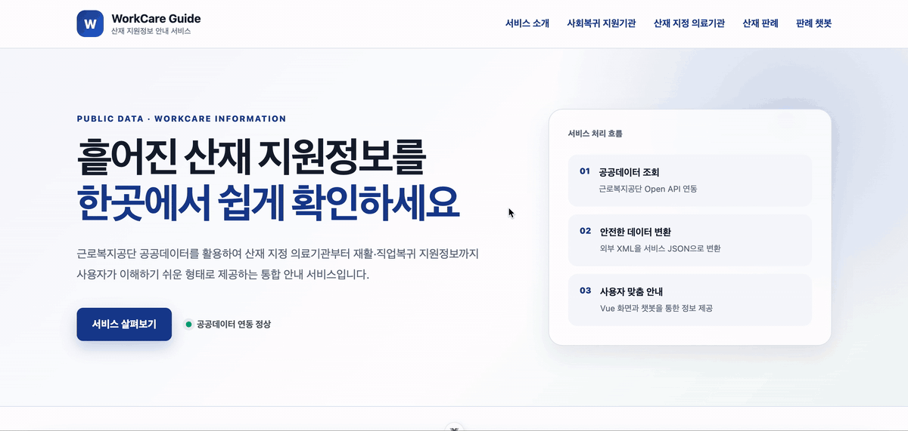

# 산재근로자 공공데이터·판례 AI 안내 서비스

근로복지공단이 제공하는 공공데이터를 활용해 산재 지정 의료기관과 재활기관을 조회하고, 판례를 검색하거나 자연어로 질문할 수 있도록 구현한 개인 학습 프로젝트입니다.

> 이 프로젝트는 근로복지공단의 공식 서비스가 아니며, 학습·포트폴리오 목적으로 제작했습니다. 챗봇 답변은 법률·의학적 판단을 대신하지 않습니다.

## 시연 영상

### 1. 근로복지공단 공공데이터 통합 조회

근로복지공단 Open API를 연계하여 산재 지정 의료기관, 약국, 재활기관 등의 정보를 조회합니다.  
외부 XML 응답은 백엔드에서 가공하여 프론트엔드에 일관된 JSON 형식으로 제공합니다.

<br>



<br><br>

### 2. 유사 산재 판례 검색 챗봇

사용자가 사고 내용을 자연어로 입력하면 문장을 벡터로 변환하고, Oracle AI Vector Search를 이용하여 의미적으로 유사한 산재 판례를 검색합니다.

<br>


## 핵심 기능

- 산재 지정 의료기관·약국·재활인증 의료기관 조회
- 사회복귀 지원기관 조회
- 산재 판례 조건 검색 및 상세 조회
- 공공데이터 판례 수집과 Oracle `MERGE` 기반 중복 방지
- Ollama `bge-m3` 임베딩과 Oracle AI Vector Search를 이용한 유사 판례 검색
- 검색 근거를 함께 제공하는 판례 안내형 챗봇
- 공통 오류 응답과 외부 API 응답 검증

## 기술 구성

| 구분 | 기술 |
| --- | --- |
| Backend | Java 17, eGovFrame Boot 5.0, Spring Boot 3.5, MyBatis |
| Frontend | Vue 3, Vite, Vue Router |
| Database | Oracle AI Database 26ai Free, Oracle VECTOR |
| AI | Ollama, `bge-m3` 1024차원 임베딩 |
| External API | 공공데이터포털 근로복지공단 Open API |
| Development | Eclipse eGovFrame IDE, Docker Desktop, DBeaver |

## 구조

```text
workcare-ai-guide/
├── workcare-guide-api/   # eGovFrame Boot REST API
└── workcare-guide-ui/    # Vue 사용자 화면
```

```text
Vue 화면
   ↓ REST API
eGovFrame Controller
   ↓
Service / Public Data Client / MyBatis Mapper
   ↓                         ↓
공공데이터포털             Oracle 26ai
                              ↓
                         Ollama bge-m3
```

## 보안 설정

인증키와 비밀번호는 소스코드에 저장하지 않습니다. 실행 전에 다음 환경변수를 설정해야 합니다.

```bash
export WORKCARE_DB_PASSWORD="본인의 Oracle 비밀번호"
export DATA_GO_KR_SERVICE_KEY="공공데이터포털 일반 인증키(Decoding)"
```

필요하면 다음 값도 실행환경에 맞게 변경할 수 있습니다.

```bash
export WORKCARE_DB_URL="jdbc:oracle:thin:@//localhost:1521/FREEPDB1"
export WORKCARE_DB_USERNAME="WORKCARE_APP"
export OLLAMA_BASE_URL="http://localhost:11434"
export OLLAMA_EMBEDDING_MODEL="bge-m3"
```

## 실행 방법

### 1. 사전 준비

- Java 17
- Oracle AI Database 26ai Free
- Node.js 24 이상
- Ollama와 `bge-m3` 모델
- 공공데이터포털 활용신청 및 인증키

```bash
ollama pull bge-m3
```

### 2. Backend

```bash
cd workcare-guide-api
mvn spring-boot:run
```

정상 실행 확인:

```bash
curl -H "Accept: application/json" http://localhost:8080/api/health
```

### 3. Frontend

```bash
cd workcare-guide-ui
npm install
npm run dev
```

브라우저에서 `http://localhost:5173`으로 접속합니다. 개발 중 `/api` 요청은 Vite 프록시를 통해 `http://localhost:8080`으로 전달됩니다.

## 구현 과정에서 해결한 문제

- XML·JSON이 혼재한 공공데이터 응답을 DTO 계층으로 분리해 안정적으로 역직렬화
- 공공데이터 재수집 시 중복 저장을 막기 위해 사건번호·법원 기준 `MERGE` 적용
- 원문 해시가 변경된 판례만 갱신해 불필요한 재임베딩 방지
- 판례 원문을 청크로 나누고 1024차원 벡터로 저장해 의미 기반 유사도 검색 구현
- Oracle Docker 컨테이너를 영속 볼륨으로 전환하고 기동 파일과 데이터를 복구
- 비밀번호와 공공데이터 인증키를 환경변수로 분리해 Git 노출 방지

## 향후 개선

- DB 초기화 스크립트와 자동화 테스트 보강
- 검색 품질 평가 데이터셋과 정량 지표 구축
- 운영용 인증·인가 및 요청량 제한 적용
- 출처 링크와 면책 문구를 포함한 답변 검증 강화
